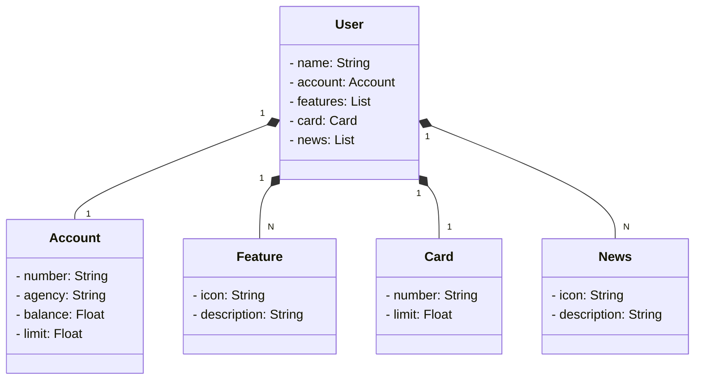

<h1 align="center"> 👨🏻‍💻 Java RESTful API 👨🏻‍💻 </h1>

📝 Descrição
Java RESTful API criado para o BootCamp Santander 2023
## Diagrama de Classes

## 🔧 Tecnologias utilizadas
* Java;
* API REST;
* Spring;
* Git & GitHub;
* Railway

## :soon: Implementação futura
* Null

## :handshake: Colaboradores
<table>
  <tr>
    <td align="center">
      <a href="http://github.com/marioslazaro">
         
        
          <b>marioslazaro</b>
        
      </a>
    </td>
  </tr>
</table>

## :dart: Status do projeto
Null

